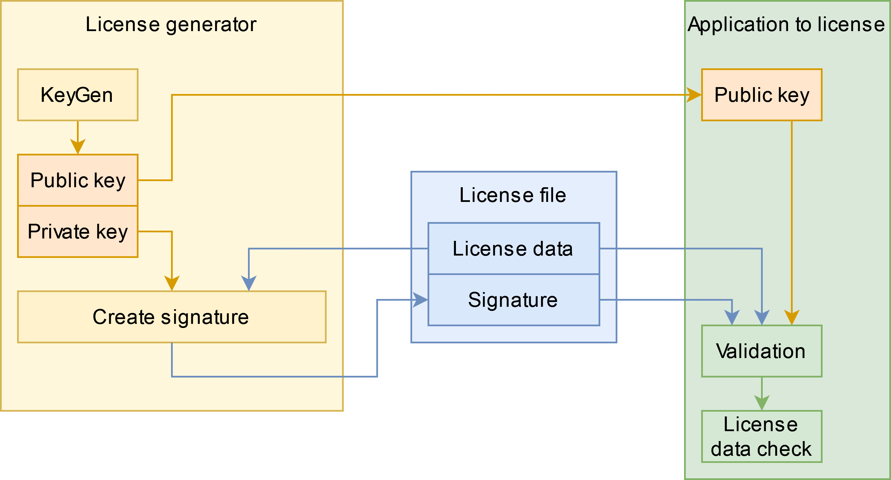

# LicenseManager

## Conzept
# LicenseManager

## Conzept

    

### License generator
The license generator is an external tool to create and manage licenses for your application. 
You can find the tool in the subfolder: **examples\LicenseGenerator**
[See License generator documentation](examples/LicenseGenerator/README.md)

### License file
The license file contains the informations about the license in a json format. 
The data can be customized depending on the needs of your licensing model. 
For license validation, the signature of the license data is also contained in the file.

### Application to license

## Security