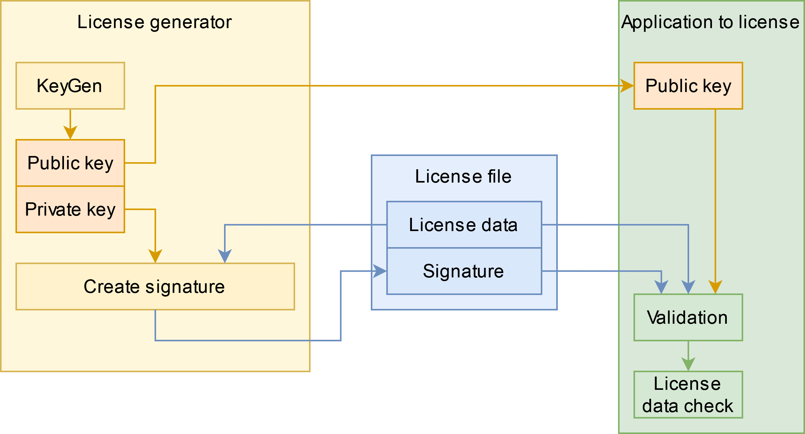

# LicenseManager

## Overview
* [About](#about)
* [Features](#features)
* [Concept](#concept)
* [License generator](examples/LicenseGenerator/README.md)
* [License file](documentation/LicenseFile.md)
* [Security](documentation/Security.md)

---
## About
This library is used to add a license check for an application. 
A user can only use the application if a valid license file is available.

## Features
* Generating random private keys using openSSL.
* Generating the public key from a private key.
* Signing text using a private key.
* The library combines the openSSL calls to a simple class which is easy to use.
* Compiletime random string XOR encryption is available to hide constant strings in the binary file (used to hide the public key).
* [License generator](examples/LicenseGenerator/README.md) to manage and create licenses for any project that uses this library.

## Conzept

    

The [License generator](examples/LicenseGenerator/README.md) is an external tool to generate the private and public -key for the application that needs a license. 
The public key needs to be embedded in the application.
The License generator generates and signs the created license files. 
The validation functionality needs to be implemented in the application that needs a license. 
See [License](documentation/LicenseFile.md) for mor infos about the implementation.
