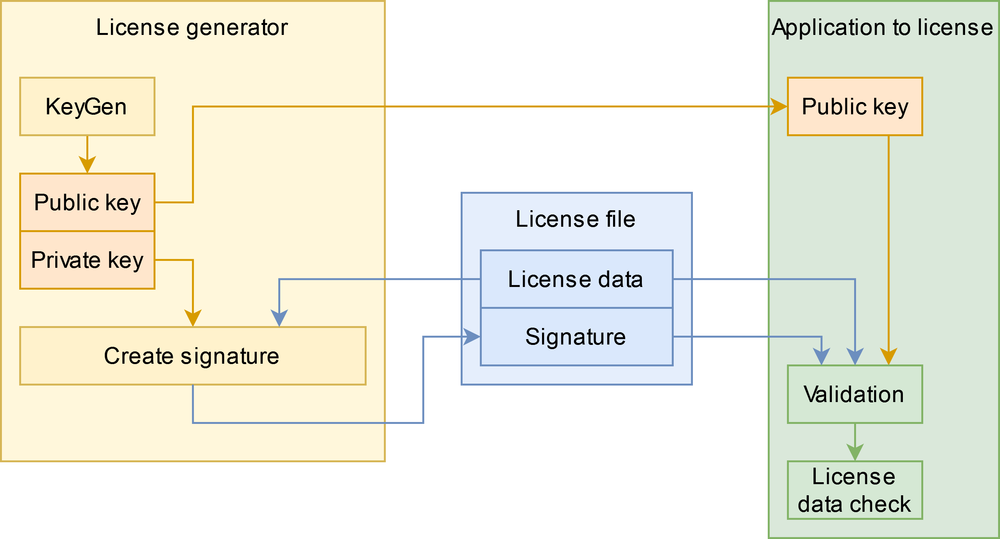

# LicenseManager

## Overview
* [About](#about)
* [Features](#features)
* [Dependencies](#dependencies)
* [Concept](#concept)
* [License generator](examples/LicenseGenerator/README.md)
* [License file](documentation/LicenseFile.md)
* [Security](documentation/Security.md)
* [Hardening — crack-safety methods](documentation/Hardening.md)

---
## About
This library is used to add a license check for an application. 
A user can only use the application if a valid license file is available.

## Dependencies
* **OpenSSL 3.0 or newer** (3.x / 4.x). The library uses the modern EVP API and
  is no longer compatible with OpenSSL 1.1.x.
  * Windows: install either the Shining Light "Win64 OpenSSL v3.x" package
    (full, not Light — the Light variant ships no headers) into
    `C:/Program Files/OpenSSL-Win64`, or the "OpenSSL 3.x Toolkit" component
    from the Qt Maintenance Tool (installs to `C:/Qt/Tools/OpenSSLv3/Win_x64`).
    Both locations are auto-detected by `dependencies/OpenSSL.cmake`. To use a
    different location, pass `-DOPENSSL_ROOT_DIR=<path>` when configuring.
  * Linux / macOS: install the system package (`libssl-dev` on Debian/Ubuntu,
    `openssl@3` via Homebrew).
* **Qt** (Core module) for JSON and file I/O.

## Features
* Generating random private keys using openSSL.
* Generating the public key from a private key.
* Signing text using a private key (RSA-2048 / SHA-256 via the modern OpenSSL EVP interface).
* The library combines the openSSL calls to a simple class which is easy to use.
* Compiletime random string XOR encryption is available to hide constant strings in the binary file (used to hide the public key).
* [License generator](examples/LicenseGenerator/README.md) to manage and create licenses for any project that uses this library.

### Crack-safety (see [Hardening](documentation/Hardening.md))
* Full-payload signing — license data, name, hardware binding and validity window are all tamper-protected.
* Node-locking via a **composable** hardware fingerprint (you choose which components + a salt), with fuzzy *K-of-N* matching.
* Signed validity window (`validFrom` / `validUntil`) with an anti-rollback clock check.
* Anti-tamper helpers: debugger detection, timing probe, code checksum, and a guard token.
* Non-boolean verification (`deriveSecret`) so cracking cannot be reduced to flipping one `if`.

## Conzept

    

The [License generator](examples/LicenseGenerator/README.md) is an external tool to generate the private and public -key for the application that needs a license. 
The public key needs to be embedded in the application.
The License generator generates and signs the created license files. 
The validation functionality needs to be implemented in the application that needs a license. 
See [License](documentation/LicenseFile.md) for mor infos about the implementation.
