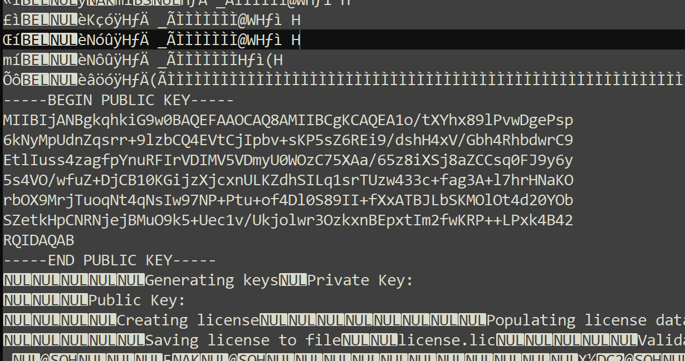
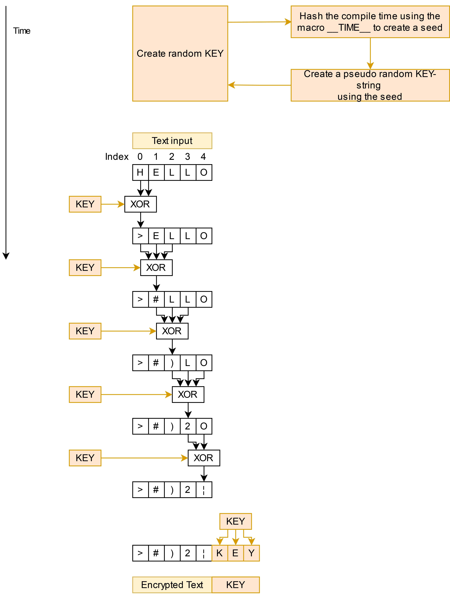

# Security

## Overview
* [License validation](#license-validation)
* [Public key problem](#public-key-problem)
* [Public key solution](#public-key-solution)
* [Compile time string encryption](#compile-time-string-encryption)
---
## Pro and cons
➕ Strings are not readable in the binary file.<br>
➕ Strings are readable in the source code.<br>
➕ Simple to use in code.<br>
➖ With enough effort a attacker can find where the text is located.<br>
➖ If the attacker can locate the text, he can decrypt the text.<br>
➖ Key for decryption is stored in the encrypted text.<br>

## License validation
To check if an attacker has modified the important license information, a validation check is needet.<br>
Each license was signed by a private key. Using the signature, which is contained inside the license file, the software which needs the license, can check if the license was modified.

Using the public key, the license data and the signature, openSSL checks if the license data matches the signature that was generated using the private key.

## Public key problem
Since the public key is needed to check if a license is valid or not, the public key needs to be stored inside the application.<br>
This can be done by simply storing it as const string:
```c++
const std::string publicKey = 
		"-----BEGIN PUBLIC KEY-----\n"
		"MIIBIjANBgkqhkiG9w0BAQEFAAOCAQ8AMIIBCgKCAQEA1o/tXYhx89lPvwDgePsp\n"
		"6kNyMpUdnZqsrr+9lzbCQ4EVtCjIpbv+sKP5sZ6REi9/dshH4xV/Gbh4RhbdwrC9\n"
		"EtlIuss4zagfpYnuRFIrVDIMV5VDmyU0WOzC75XAa/65z8iXSj8aZCCsq0FJ9y6y\n"
		"5s4VO/wfuZ+DjCB10KGijzXjcxnULKZdhSILq1srTUzw433c+fag3A+l7hrHNaKO\n"
		"rbOX9MrjTuoqNt4qNsIw97NP+Ptu+of4Dl0S89II+fXxATBJLbSKMOlOt4d20YOb\n"
		"SZetkHpCNRNjejBMuO9k5+Uec1v/Ukjolwr3OzkxnBEpxtIm2fwKRP++LPxk4B42\n"
		"RQIDAQAB\n"
		"-----END PUBLIC KEY-----\n";
```
This creates a problem.<br>
The applications binary file can be opened using a text editor.<br>
You can search for the public key and can find it in readable text.

<div style="text-align: center;">
    
</div>

The attacker would be able to generate its own license, using the [LicenseCreator](../examples/LicenseGenerator/README.md) and could put his own public key inside the binary file to crack the application.<br>
This must be prevented.

## Public key solution
Since text can always be viewed in a binary, a solution to this problem can be a simple encyrption of the text.<br>
Text which shuld not be visible in the binary file shuld be saved using the encrypted string methode.

```c++
// Use an binary encrypted public key
constexpr auto encryptedPublicKey = LicenseManager::EncryptedConstant::encrypt_string(
	"-----BEGIN PUBLIC KEY-----\n"
	"MIIBIjANBgkqhkiG9w0BAQEFAAOCAQ8AMIIBCgKCAQEA1o/tXYhx89lPvwDgePsp\n"
	"6kNyMpUdnZqsrr+9lzbCQ4EVtCjIpbv+sKP5sZ6REi9/dshH4xV/Gbh4RhbdwrC9\n"
	"EtlIuss4zagfpYnuRFIrVDIMV5VDmyU0WOzC75XAa/65z8iXSj8aZCCsq0FJ9y6y\n"
	"5s4VO/wfuZ+DjCB10KGijzXjcxnULKZdhSILq1srTUzw433c+fag3A+l7hrHNaKO\n"
	"rbOX9MrjTuoqNt4qNsIw97NP+Ptu+of4Dl0S89II+fXxATBJLbSKMOlOt4d20YOb\n"
	"SZetkHpCNRNjejBMuO9k5+Uec1v/Ukjolwr3OzkxnBEpxtIm2fwKRP++LPxk4B42\n"
	"RQIDAQAB\n"
	"-----END PUBLIC KEY-----\n");
```

The function takes a readable string and encrypts the text at compile time. Only the encrypted text is stored in the binary file.

Because the text is stored in an encrypted form, we need a way to decrypt the text again. This is done the following way:
```C++
std::string decryptedPublicKey = LicenseManager::EncryptedConstant::decrypt_string(encryptedPublicKey);
```
----
> ⚠️ **Do not use this encryption/decryption wrong:** ⚠️<br>

The example below does not work as intended.<br>
The compiler does optimize the code and remove the decryption and entcryption of the text. The text will be visible in the binary file.
```C++
using namespace LicenseManager::EncryptedConstant;
std::string message = decrypt_string(encrypt_string("Secret message"));
```


## Compile time string encryption
The following diagram shows how a text gets encrypted.
The random key gets attached at the end of the message.
Because the key is at the end of the text, the decryption function can find the key.

<div style="text-align: center;">
    
</div>

Each character gets XORed with the key and the neighbour chars.
Both neighbours are needed to prevent the attacker from finding the secret message when he try's to decrypt the whole binary file using the same key.<br>
The secret message can only be found if the attacker knows exactly where the message end is located.
